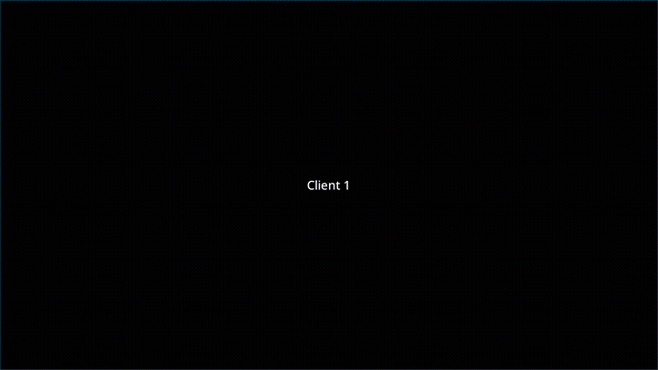

# ZestWM

**An X11/XLibre window manager built around workspaces, not window tags.**

ZestWM is a small, fast tiling window manager for X11/XLibre. It is not a
minimalist clone of classic tag-based WMs, and it is not chasing
compositor eye candy. The product idea is simpler: **stable workspace
identity**, a **BSP tree** for tiling, and a **file-based config** you
can edit and reload without recompiling.

If you want “another tiling WM with more keybinds”, look elsewhere. If
you want a workspace-first X11/XLibre WM with scratchpad overlays, tab
groups, and a config that reads like a contemporary tiled desktop,
ZestWM is aimed at that.



## Why ZestWM is different

| Axis | ZestWM |
| --- | --- |
| Addressing | **Workspace-first**: named/numeric workspaces in a dynamic registry. EWMH desktops follow that registry. No bitmask-as-primary model. |
| Tiling | **BSP tree** layout: splits, ratios, directional focus/swap, and **tab groups** with a groupbar. |
| Scratchpads | **Special overlays** (`special:<tag>`): one overlay tag visible per monitor, optional dim behind it, silent moves, rule routing. |
| Configuration | **Only** `zestwm.conf` (XDG path or `-c`). No compile-time `config.h`. Binds, workspaces, rules, and colors live in one editable file. |
| Control plane | **`zestctl`** for queries and dispatch (workspaces, clients, special overlay, moves). |
| Reload | Session-oriented restore of tree state (and floating geometry) across reload/restart paths covered by nested integration tests. |
| Stack | Modern **C++23** on **XCB** (Cairo/Pango bar). Intentionally **X11/XLibre**, not a Wayland compositor. |

What ZestWM deliberately is **not**:

- Not a tag-mask WM dressed up with new names.
- Not a Wayland compositor or a visual effects stack (blur, VRR, fancy
  decorations belong to a compositor, not this process).
- Not configured by rebuilding the binary for every bind change.

## Requirements

Meson (>= 1.3.0) and a C++23 toolchain. Development packages so
pkg-config can find at least: `xcb`, `xcb-cursor`, `cairo-xcb`,
`pangocairo`, `glib-2.0`, and `fontconfig` (names vary by distro).

## Installation

From the repository root:

```text
meson setup build
meson compile -C build
meson install -C build
```

Default prefix is `/usr/local`. Override at configure time:

```text
meson setup build --prefix=/usr
```

Run `meson install` as root only if your prefix requires it.

Release tarball from a git checkout:

```text
meson dist -C build
```

## Running

In `.xinitrc` (or your display-manager session command):

```text
exec zestwm
```

## Configuration

Copy `examples/zestwm.conf` to `~/.config/zestwm/zestwm.conf` (or
`$XDG_CONFIG_HOME/zestwm/zestwm.conf`) and edit it, or pass a path:

```text
exec zestwm -c /path/to/zestwm.conf
```

Start from the example: declare workspaces, a `binds { }` block, and
optional `workspace = special:…` overlays. Details:

- [docs/config/workspaces.md](docs/config/workspaces.md) — registry,
  names, special overlays, policies
- [docs/config/binds.md](docs/config/binds.md) — hotkeys and dispatchers
- [docs/config/group.md](docs/config/group.md) — tab groups / groupbar
- [docs/behavior/must-features.md](docs/behavior/must-features.md) —
  runtime contracts covered by tests

### Value expansion

Config values support iterative expansion:

- leading `~` expands to `$HOME` (`~/...` and bare `~`);
- `$VAR` / `${VAR}` use config overrides first, then the process
  environment;
- invalid `${...}` names stay literal; malformed `${...` (missing `}`)
  keeps `$` and continues parsing.

## Development

C++23 systems style: explicit casts, scoped enums, RAII, early returns.
Keep behavior-preserving refactors separate from feature work. See
[AGENTS.md](AGENTS.md).

Integration probes that touch reload must use the nested suite so they
never hit your host session display:

```text
tests/integration/run_xephyr_suite.sh --build-dir build --no-build --headless \
  --test reload-multi-special-workspace
```

Debug knobs: `ZESTWM_NESTED_X11_DEBUG=1`, `ZESTWM_TEST_TRACE=1`.

Product backlog: [todo.md](todo.md).

## License

ZestWM is released under the MIT License. See [LICENSE](LICENSE).
